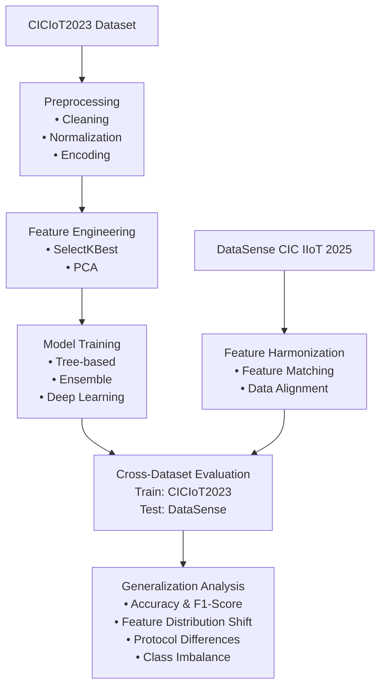

## judul proyek akhir
keyword: machine learning, cic iot 2025, network security, research

1. Cross-Dataset Evaluation of IoT/IIoT Intrusion Detection Model Generalization on CIC IoT 2023 and CIC IIoT 2025 / Evaluasi Cross-Dataset terhadap Generalisasi Model Intrusion Detection IoT/IIoT pada Dataset CIC IoT 2023 dan CIC IIoT 2025

Perkembangan Internet of Things (IoT) dan Industrial Internet of Things (IIoT) telah mendorong adopsi perangkat terhubung secara masif di berbagai sektor, mulai dari konsumen rumahan hingga infrastruktur industri kritis. Ekspansi ini membuka permukaan serangan yang luas bagi penyerang siber, sementara karakteristik domain yang berbeda, yakni IoT yang bersifat consumer-focused dan IIoT yang bersifat industri-focused, menambahkan kompleksitas dalam perancangan sistem keamanan jaringan. Untuk menjawab tantangan ini, komunitas riset telah menghasilkan dataset benchmark seperti CICIoT2023 dan DataSense (CIC IIoT 2025) guna memfasilitasi pengembangan dan evaluasi IDS berbasis machine learning.
CICIoT2023 dirancang sebagai dataset serangan IoT berskala besar yang dibangun di atas topologi nyata dengan 105 perangkat dan 33 skenario serangan dalam tujuh kategori. Dataset ini telah menjadi benchmark utama bagi berbagai penelitian IDS berbasis machine learning yang menghasilkan berbagai model IDS terpublikasi dengan performa kompetitif. Di sisi lain, DataSense sebagai CIC IIoT 2025 menghadirkan testbed IIoT yang realistis dengan karakteristik lingkungan industri, meliputi sensor pembaca, SCADA systems, dan protokol komunikasi spesifik seperti Modbus dan OPC-UA, serta mengintegrasikan data sensor dan jaringan yang disinkronkan dengan pendekatan multi-objective feature selection. Kombinasi kedua dataset ini menjadikan studi cross-dataset menarik untuk dieksplorasi lebih lanjut.
Meskipun berbagai model machine learning telah mencatatkan akurasi tinggi pada CICIoT2023, evaluasi tersebut umumnya dilakukan secara in-dataset, yaitu model dilatih dan diuji pada dataset yang sama, sehingga tidak mencerminkan kemampuan generalisasi model ketika diterapkan pada lingkungan IIoT yang berbeda secara fundamental. Perbedaan karakteristik antara lingkungan IoT consumer dan IIoT industri, mencakup skala data, jenis protokol, pola lalu lintas steady-state, serta profil attack surface, dapat menyebabkan domain shift yang signifikan. Hingga saat ini, masih terbatas penelitian yang secara sistematis mengevaluasi sejauh mana model IDS yang dilatih pada CICIoT2023 dapat mempertahankan performanya ketika diterapkan pada DataSense (CIC IIoT 2025), dan faktor-faktor apa saja yang memengaruhi keberhasilan generalisasi tersebut.
Berdasarkan celah tersebut, penelitian ini bertujuan melakukan evaluasi cross-dataset terhadap generalisasi model deteksi intrusi IoT/IIoT, dengan menggunakan model-model yang telah dipublikasikan dari CICIoT2023 dan mengujinya pada dataset DataSense (CIC IIoT 2025). Penelitian ini akan menganalisis karakteristik kedua dataset secara mendalam, mengevaluasi performa berbagai keluarga algoritma machine learning, meliputi deep learning, ensemble, dan tree-based, lintas domain, mengidentifikasi feature yang paling robust, serta menghasilkan rekomendasi praktis bagi peneliti yang ingin menerapkan machine learning pada dataset CIC IIoT 2025 sebagai rujukan foundational.


attack detection

```
Latar belakang permasalahan, tujuan, dan metode yang digunakan
```


