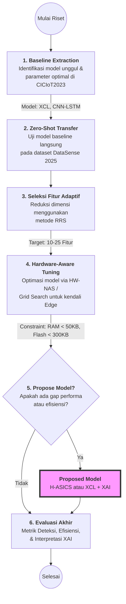

## overview
Hasil riset mengenai, em, referensi utama dan yang saya pakai datasetnya untuk penelitian kali ini, itu overall membahas tentang bagaimana dataset itu tercipta dari sebuah eksperimen yang disiapkan dengan cukup rapi, niat kali.

Di akhir dari pembuatan dataset tersebut, juga dilakukan validasi, dan ada yang disiapkan penulis untuk tahapan riset selanjutnya, di antaranya: 

- Sistem Deteksi Hibrida Ringan (Hybrid Lightweight Detection System): Penulis berencana merancang sistem deteksi yang disesuaikan khusus untuk pengaturan IIoT skala besar agar dataset dapat dimanfaatkan lebih efektif di lingkungan tersebut

- Perluasan Jangkauan Perangkat: Menambahkan lebih banyak jenis perangkat industri untuk meningkatkan representasi sistem

- Inkorporasi Serangan Baru: Memasukkan kampanye serangan yang lebih baru dan lebih canggih ke dalam dataset

- Pembaruan Dataset Secara Kontinu: Penulis berkomitmen untuk terus memperbarui dataset agar tetap relevan dengan lanskap ancaman IIoT yang terus berubah

## rekomendasi tahapan
1. Ekstraksi Parameter Baseline (Dataset 2023): Identifikasi model yang terbukti unggul pada CICIoT2023, seperti XGBoost, CatBoost, LightGBM (pendekatan XCL), atau model hibrida seperti CNN–LSTM

Catat hyperparameter optimalnya (misalnya: learning rate, jumlah estimators, atau kernel size)

2. Penerapan Tanpa Penyesuaian (Zero-Shot Transfer): Jalankan model tersebut langsung pada dataset 2025 (DataSense) menggunakan parameter dari dataset 2023
Langkah ini berfungsi untuk mengukur kemampuan generalisasi parameter lama pada data baru

3. Seleksi Fitur Adaptif: Karena dataset 2025 mungkin memiliki karakteristik fitur yang berbeda, gunakan teknik seleksi fitur seperti Relevance–Redundancy–Synergy (RRS) untuk menyaring 10–25 fitur paling penting guna mengurangi beban komputasi hingga 3 kali lipat

Fine-Tuning & Penyesuaian Model: Lakukan optimasi ulang menggunakan Grid Search atau Hardware-Aware NAS (HW-NAS) agar arsitektur model sesuai dengan keterbatasan perangkat (seperti RAM < 50 KB atau Flash < 300 KB) pada dataset baru

Propose Model yang "Lebih Sesuai": Kamu bisa mengusulkan model baru (misalnya penggabungan XCL dengan XAI atau model H-ASICS) jika performa baseline menurun drastis atau jika efisiensi sumber daya tidak tercapai

Yang saya dapat sih matriks, matriks stabilitas, dan evaluasinya bisa memakai Expected Calibration Error, yaitu ECE, dan Interpretability SHAP atau LIME.

Dari keduanya itu, mengukur tingkat kepercayaan model sesuai dengan nilai akurasi aktualnya. Jujur, nggak paham, tapi nanti aku explore.

Lalu, untuk Interpretability, itu ngejelasin di fitur mana yang paling berbobot untuk, ee, memicu peringatan serangan. Misalnya, alert dipicu karena rasio request to response yang abnormal. 

