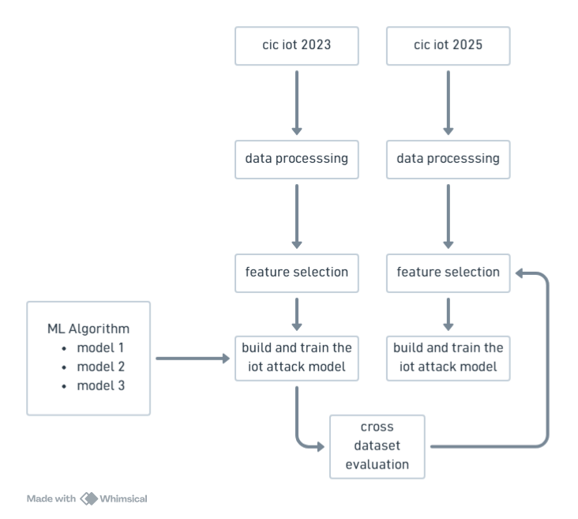

# Cross-Dataset Evaluation of IoT/IIoT Intrusion Detection Model Generalization on CIC IoT 2023 and CIC IIoT 2025

Wahyu Ikbal Maulana / 3 SDT B
3323600056

---

ide awalnya berasal dari dataset yang baru, kemudian dataset baru ini saya eksplorasi dan gimana cara saya bisa merumuskan project implemntasi ml di cyber security  

1. new dataset - cic iot 2025 [sumber data]

mengapa dataset ini penting/diperlukan?

2. Serangan siber dan lingkungan IoT yang terus berkembang. [data yg nunjukin itu]

mengapa serangan siber dan lingkunbgan diperlukan dataset baru

3. cic iot 2023 outdated [penjelasan detailnya]

Bagaimana dataset ini bisa dipakai untuk tujuan tersebut? 

4. dataset digunaskan untuk dilakukan prediksi ml

bukankah sulit?

5. dgn cross dataset [penjelasan detail di slide selanjutnya] 
---

# 5 Why

---

---

| Aspek                          | CIC IoT 2023                                                                 | CIC IIoT 2025 (DataSense)                                                                                     |
| ------------------------------ | ---------------------------------------------------------------------------- | ------------------------------------------------------------------------------------------------------------- |
| Fokus utama                    | Keamanan jaringan IoT umum (smart environment)                               | Keamanan Industrial IoT (IIoT) dengan fokus sensor + jaringan                                                 |
| Lingkungan uji                 | Topologi IoT dengan 105 perangkat IoT nyata                                  | Testbed IIoT dengan 40 perangkat (beragam sensor industri, IoT, edge, dll.)                                   |
| Modalitas data                 | Trafik jaringan (flow/packet ke CSV)                                         | Data sensor time‑series + trafik jaringan tersinkron                                                          |
| Jumlah jenis serangan          | 33 jenis serangan                                                            | 50 jenis serangan                                                                                             |
| Kategori serangan              | 7 kategori (DDoS, DoS, Recon, Web, Brute Force, Spoofing, Mirai)             | 7 kategori serangan (dengan cakupan skenario IIoT yang lebih luas)                                            |
| Label utama                    | Benign vs 33 attack labels                                                   | Benign vs 50 attack types + dukungan task multi‑kelas dan analisis resource use                               |
| Jumlah fitur (baseline publik) | ±48 fitur per flow dalam banyak studi                                        | Tidak satu angka baku; menyediakan banyak fitur sensor dan jaringan + subset hasil feature selection          |
| Tujuan desain                  | Benchmark realistik untuk deteksi & klasifikasi serangan IoT berbasis trafik | Benchmark realistik untuk deteksi serangan IIoT dengan feature selection multi‑objektif (akurasi vs resource) |

---

hasil akurasi cic iot 2025 dgn feature selection tertentu
hasil akurasi cic iot 2025 dgn feature selection tertentu
