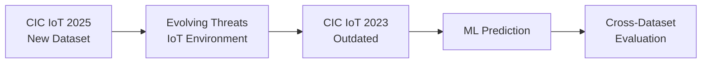
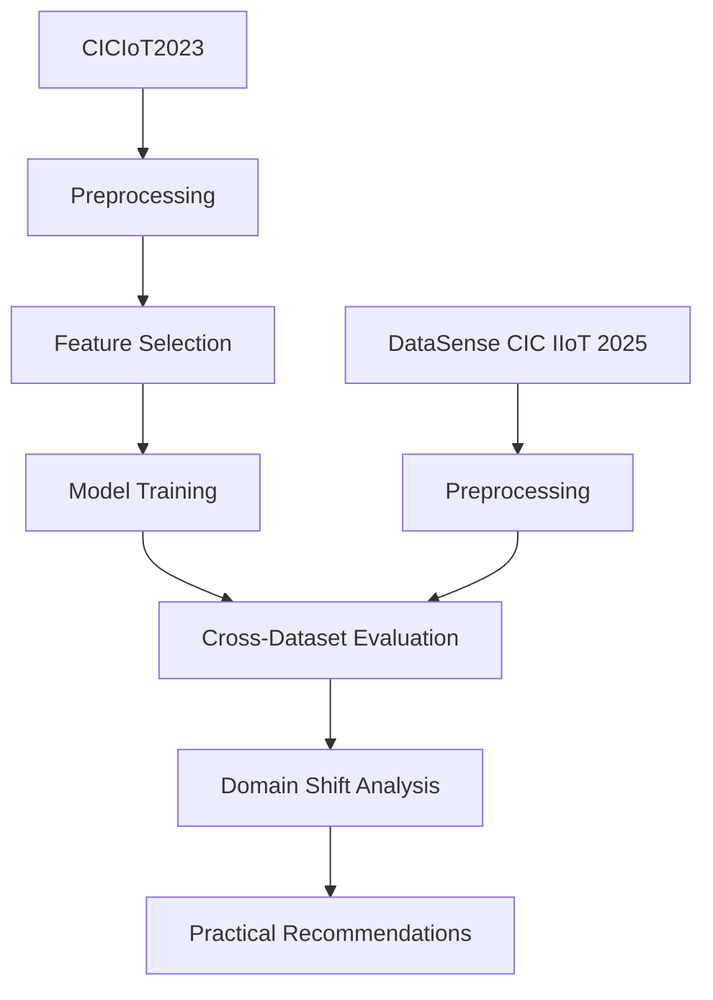

# Cross-Dataset Evaluation of IoT/IIoT Intrusion Detection Model Generalization on CIC IoT 2023 and CIC IIoT 2025

Wahyu Ikbal Maulana / 3 SDT B
3323600056

---

ide awalnya berasal dari dataset yang baru, kemudian dataset baru ini saya eksplorasi dan gimana cara saya bisa merumuskan project implemntasi ml di cyber security  

1. new dataset - cic iot 2025 [sumber data]

mengapa dataset ini penting/ diperlukan?

2. Serangan siber dan lingkungan IoT yang terus berkembang. [dat yg nunjukin itu]

mengapa serangan siber dan lingkunbgan diperlukan dataset baru

3. cic iot 2023 outdated [penjelasan detailnya]

Bagaimana dataset ini bisa dipakai untuk tujuan tersebut? 

4. dataset digunaskan untuk dilakukan prediksi ml

bukankah sulit?

5. dgn cross dataset [penjelasan detail di slide selanjutnya] 
---

# 5 Why

---

## Research Methodology

---

=

---

=